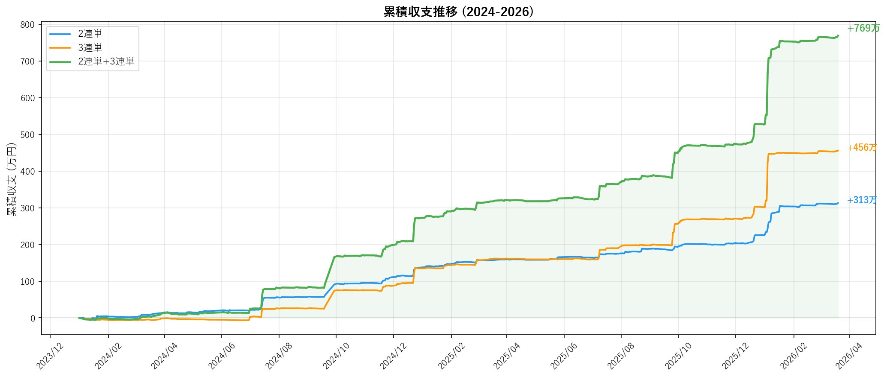
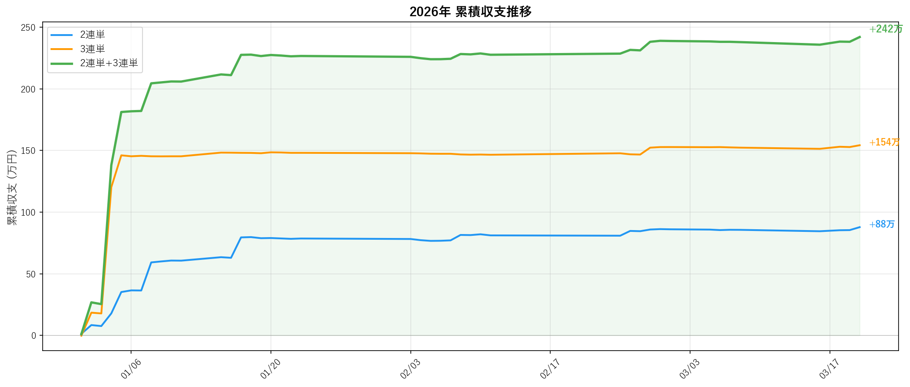

# 競輪AI予測 (keirin-ai-predictor)

LightGBM LambdaRankモデルによる競輪レースの着順予測 + 自動賭け戦略システム。

**ダッシュボード**: https://haruqube.github.io/keirin-ai-predictor/

---

## 収支実績

### 累積収支推移 (2024-2026)



| 賭式 | 投資額 | 回収額 | ROI | 収支 |
|------|--------|--------|-----|------|
| 2連単 | 445万 | 759万 | 170% | **+313万** |
| 3連単 | 228万 | 719万 | 315% | **+456万** |
| **合計** | **674万** | **1,478万** | **219%** | **+769万** |

> バックテスト期間: 2024/01〜2026/03（3,765レース、F2除外）

### 2026年 累積収支推移



| 賭式 | 投資額 | 回収額 | ROI | 収支 |
|------|--------|--------|-----|------|
| 2連単 | 46万 | 134万 | 289% | **+88万** |
| 3連単 | 23万 | 178万 | 761% | **+154万** |
| **合計** | **70万** | **312万** | **447%** | **+242万** |

> 3連単追加により2026年の収支が **+88万 → +242万（2.76倍）** に増加

---

## 賭け戦略

### 2連単（◎→○▲△△ の4点買い）

信頼度（◎-○スコア差）に応じた賭け金。◎1着固定で2着相手を4点。

| 信頼度 | ラベル | 賭け金 | バックテストROI |
|--------|--------|--------|---------------|
| ≥ 1.00 | HIGH | 500円×4点=2,000円 | 170%+ |
| ≥ 0.80 | MED+ | 200円×4点=800円 | 160%+ |
| ≥ 0.50 | MED | 100円×4点=400円 | 140%+ |
| < 0.50 | LOW | 見送り | — |
| F2 | SKIP | 見送り | — |

### 3連単（◎-○▲△-○▲△ の6点フォーメーション）

◎1着固定、2-3着を○▲△の組み合わせ。高配当を狙う。

| 信頼度 | ラベル | 賭け金 | バックテストROI |
|--------|--------|--------|---------------|
| ≥ 2.00 | S3-HIGH | 500円×6点=3,000円 | 322% |
| ≥ 1.50 | S3-MED+ | 200円×6点=1,200円 | 495% |
| ≥ 1.00 | S3-MED | 100円×6点=600円 | 169% |
| < 1.00 | LOW | 見送り | — |

---

## 予測精度

| 指標 | 値 |
|------|------|
| ◎的中率（Top1） | **50.9%** |
| Top1が3着以内 | **78.8%** |
| NDCG@3 | **0.824** |
| 特徴量数 | 44 |

### 信頼度スコアの効果

| 信頼度 | 条件 | レース割合 | Top1的中率 | Top1が3着以内 |
|--------|------|-----------|-----------|-------------|
| 高信頼 | ≥ 2.3 | 15% | **86.7%** | **97.9%** |
| 中信頼 | ≥ 0.85 | 55% | 46.1% | 78.5% |
| 低信頼 | < 0.85 | 30% | 31.4% | 63.9% |

---

## プロジェクト構成

```
keirin-ai-predictor/
├── data/               # スクレイパー・キャッシュ
│   ├── scraper.py      # netkeirinスクレイパー（2連単・3連単配当取得）
│   └── cache/          # HTMLキャッシュ（~15,000ファイル）
├── db/                 # SQLiteデータベース
│   ├── schema.py       # テーブル定義・CRUD
│   └── keirin.db       # 63,508レース・2,673選手
├── features/           # 特徴量エンジニアリング
│   ├── builder.py      # 統合ビルダー（44特徴量）
│   ├── rider_features.py   # 選手成績特徴量
│   ├── race_features.py    # レース条件特徴量
│   ├── line_features.py    # ライン構成特徴量
│   └── margin_parser.py    # 着差パーサー
├── models/             # 機械学習モデル
│   ├── lgbm_ranker.py  # LightGBM LambdaRank
│   └── base.py         # 基底クラス
├── scripts/            # 実行スクリプト
│   ├── predict_races.py       # 日次予測（2連単+3連単推奨）
│   ├── daily_pipeline.py      # 日次自動パイプライン
│   ├── train_model.py         # モデル学習
│   ├── backtest_roi.py        # ROIバックテスト
│   ├── generate_article.py    # 記事生成
│   ├── tune_hyperparams.py    # Optunaチューニング
│   └── sync_to_supabase.py   # Supabase同期
├── publishing/         # 記事・SNS連携
│   └── templates/      # Jinja2テンプレート
├── backtest/           # 評価モジュール
├── docs/               # GitHub Pages
│   └── index.html      # ダッシュボード（SPA）
├── config.py           # 設定・戦略定数
└── README.md
```

## データパイプライン

```
netkeirin → スクレイピング → SQLite → 特徴量構築 → LGBMモデル → 予測
                                                                  ↓
                              Supabase ← 同期 ← 予測結果 → ライン補正
                                  ↓                          ↓
                            GitHub Pages              2連単+3連単
                            ダッシュボード             賭け推奨生成
```

## 技術スタック

- **モデル**: LightGBM LambdaRank（Optunaハイパーパラメータ最適化済み）
- **特徴量**: 44次元（選手成績・上がりタイム・バンク相性・ライン構成・天候・年齢・オッズ等）
- **学習データ**: 2022-2025年 63,508レース
- **データソース**: netkeirin (keirin.netkeiba.com)
- **DB**: SQLite（ローカル）→ Supabase PostgreSQL（フロントエンド用）
- **フロントエンド**: バニラJS SPA（GitHub Pages）

## 主要な特徴

### ライン補正
競輪特有の「ライン戦」を反映。出走表のライン構成を解析し、予測スコアに補正を加える。

| ライン構成 | 役割 | 補正値 |
|-----------|------|--------|
| 3人ライン | 番手 | +0.30 |
| 3人ライン | 自力 | -0.20 |
| 3人ライン | 3番手 | -0.30 |
| 最強ライン所属 | — | +0.20 |

### 複合賭け戦略
2連単と3連単を信頼度に応じて併用。3連単は高配当・低的中率のため、2連単より高い信頼度閾値（≥1.00）を設定。

### ダッシュボード機能
- 日付 → 会場 → レース一覧 → 詳細の4階層ナビゲーション
- LIVE / 発走前 / 終了のリアルタイムステータス表示
- 信頼度バッジ（高/中/低）
- おすすめレース自動抽出

## 使い方

### 予測実行
```bash
# 今日のレース予測（開催場自動検出、2連単+3連単推奨表示）
python scripts/predict_races.py --date 20260321

# 特定の会場を指定
python scripts/predict_races.py --date 20260321 --velodromes 22,87
```

### 日次パイプライン
```bash
# 朝: 予測 → Supabase同期
python scripts/daily_pipeline.py --morning

# 夕: 結果取得 → 精度評価 → 収支分析（2連単+3連単）
python scripts/daily_pipeline.py --evening
```

### バックテスト
```bash
# 2024-2026年のROIバックテスト（2連単+3連単）
python scripts/backtest_roi.py --start 2024 --end 2026
```

### モデル学習
```bash
python scripts/train_model.py
python scripts/tune_hyperparams.py  # Optuna最適化
```
